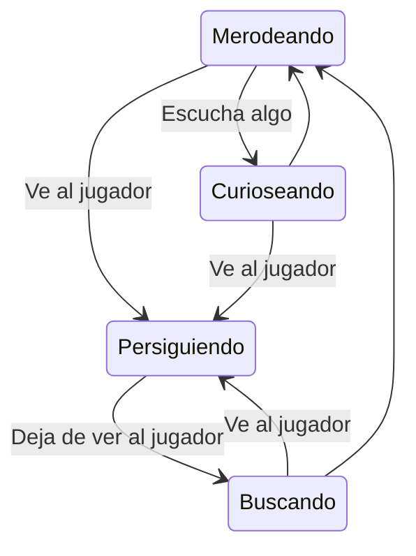

# IAV - ZURVIAL

## Autor
- Enrique Juan Gamboa ([ivo_hr](https://github.com/ivo-hr))

## Propuesta
Este proyecto final es para la asignatura de Inteligencia Artificial para Videojuegos del Grado en Desarrollo de Videojuegos de la UCM.

La propuesta de este proyecto consiste en realizar una IA que fuera capaz de ver y escuchar elementos, y que reaccione de una manera u otra según se necesitara. Tambíén tiene que ser capaz de "acordarse" de que a qué estímulo estaba reccionando y actuar de manera a acorde, independientemente si el estímulo persiste o no.

## Juego

#### Controles
WASD -> Moverse

Shift -> Correr

Space -> Saltar

Click izq. (sin objeto en mano) -> Cojer objeto

Click dcho. (con objeto en mano) -> Lanzar objeto

### Resumen
El juego se centra en escapar de una horda de zombis que aumenta incesablemente, ya sea intentando no hacer ruido y que no te vean o arrojando diversas cosas hacia ellos. El objetivo: sobrevivir el máximo tiempo posible.

### Ciclo de juego
El juego empieza desde un menú desde el cual se puede manejar mediante sliders el ratio de spawn de los zombies y la cantidad de zombies a **spawnear cada vez que se elimine a uno**. También se puede activar con un checkmark _godmode_, que quita la posibilidad de morir del jugador (su intención es para comprobar funcionalidades).

Una vez iniciado el juego dándole a jugar, aparecemos en el centro de un cruce de una ciudad rodeado de basura, desde el cual seguramente podamos escuchar a algún zombie. Podemos mover la cámara y **agarrar varios objetos** del suelo y **lanzarlos**. Al chocar con el suelo podemos escuchar el **ruido que hacen los objetos** y un efecto de partículas, el mismo que ocurre bajo nuestros pies cuando corremos o saltamos.

Si vemos un zombie, se le puede lanzar el obeto directamente. Si impacta con él, el zombie muere. Si, en cambio, se lanza **cerca de él**, el zombie lo escuchará y se dirigirá hacia él. Se pasará un periodo curioseando en ese punto hasta que vuelve a empezar a merodear. Estos estados se pueden apreciar gracias a **las partículas en su cabeza**: verde es que está merodeando, azul significa que va a curiosear, rojo significa que te ha visto y amarillo que te está buscando.

En el caso en el que zombie te vea, puede o atacarle o huir de él, ya que corres un poco más que él. Si doblas una esquina para que **no tenga vista directa contigo**, irá al **útimo punto en el que te vió** para buscarte. Se puede **engañar al zombie lanzando un objeto para que lo escuche**. El zombie creerá que eres tú y **seguirá el ruido** que ha hacho dicho objeto.

Inevitablemente (si no se ha activado godMode) algún zombie acabará alcanzándote, parando el temporizador e iniciando una serie de efectos de muerte antes de volver al menú.

Con estas tácticas se podrá intentar sobrevivir lo máximo posible: ¿matarás a los zombies, haciendo que aparezcan más? ¿O intentarás pasar desapercibido?

## Diseño de la solución

Aparte de _scripts de utilidad como GrabnThrow, GameUI, GameSettings y ZombieSpawner_ (agarrar/lanzar objetos, UI del juego, ajustes del juego desde el menú y spawneo de zombies, respectivamente), hay multitud de scripts que trabajan entre sí para formar una inteligencia para el zombie y sus interacciones con el entorno, dando al zombie una **máquina de estados** por el que va pasando en función a lo que ve y escucha.

#### Máquina de estados

Va pasando por estos estados gracias a _los scripts **ZombieVision** y **ZombieHearing**_, que emulan la vista y la escucha del zombie. Estos scripts cambian el estado del zombie directamente, y cuentan con temporizadores de atencion cuando es necesario. Para el desplazamiento de los zombies de hace uso del componente **NavMeshAgent**, se van asignado los objetivos de desplazamiento en función de lo que detecta el zombie.

A estos scripts _los asiste los scripts de **ItemsoundSim** y **PlayersoundSim**_, scripts que emulan sonido tanto en los objetos lanzados como en el jugador para que los zombies los detecten.

## Pruebas y métricas

- [Vídeo demostración de comportamientos](https://youtu.be/7uuU-owzgjM)

## Producción

| Estado  |  Tarea  |  Fecha  |  
|:-:|:--|:-:|
| ✔ | Diseño: Primer borrador | 18-05-2023 |
| ✔ | Mundo virtual, movimiento del jugador | 18-05-2023 |
| ✔ | Interacción jugador-objeto| 18-05-2023 |
| ✔ | Simulación de sonidos de objeto y jugador| 19-05-2023 |
| ✔ | Creación de zombies y movimiento | 21-05-2023 |
| ✔ | Sistema de escucha de los zombies| 22-05-2023 |
| ✔ | Sistema de visión de los zombies| 24-05-2023 |
| ✔ | Jerarquía de estados de los zombies| 24-05-2023 |
| ✔ | Interacción objeto-zombie| 24-05-2023 |
| ✔ | Interacción jugador-zombie| 25-05-2023 |
| ✔ | Menú y param. modificables desde él| 25-05-2023 |
| ✔ | Comentar funcionalidades | 26-05-2023 |
|  | _**Ideas en el baúl**_ |  |
| ✔ | Spawn aleatorio y modificable de zombies | 24-05-2023 |
| ✔ | Efectos de muerte de jugador/zombie | 25-05-2023 |
| ✔ | Distraer a los zombies en Buscando | 25-05-2023 |
| ✘ | _Flocking_ de los zombies | _no pegaba en el juego_ |
| ✘ | Unificación de la máq. de estados | ... |
| ✘ | Tipos de zombies diferentes | ... |

## Referencias

#### Recursos externos

- Skybox: https://assetstore.unity.com/packages/2d/textures-materials/sky/city-street-skyboxes-vol-1-157401

- Assets de vehiculos: https://assetstore.unity.com/packages/3d/vehicles/land/low-poly-vehicles-pack-26707

- Generador de basura: https://assetstore.unity.com/packages/tools/modeling/mess-maker-free-213803

- Demkeys: https://dogangunes91.itch.io/metro-city

#### Documentación de ayuda

- Unity manual: https://docs.unity3d.com/Manual/index.html

- Unity forums: https://forum.unity.com/

- Ring Effects: https://www.youtube.com/watch?v=CVsZ98TSEwI&t=178s

#### Inspiración

- Silent Hill Downpour: https://www.youtube.com/watch?v=n3JkI3fCuw8&t=132s
- Rio 3D TV: https://www.youtube.com/watch?v=Gq8QfcVqHQs

